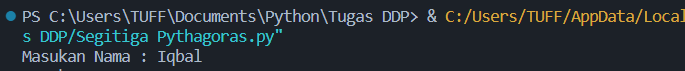
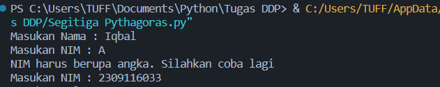
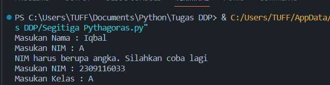
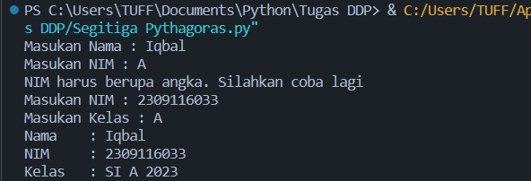
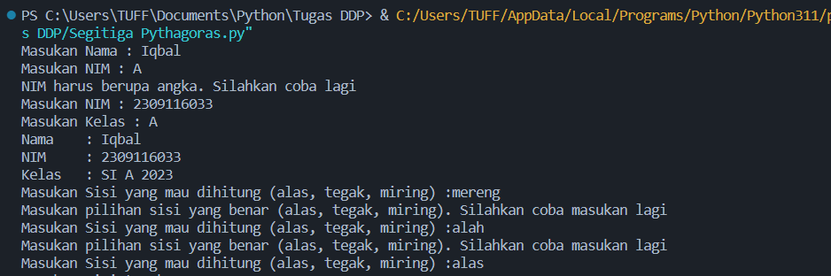
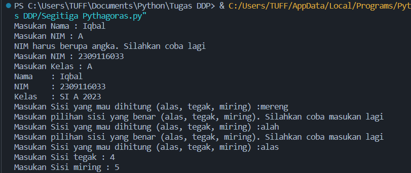
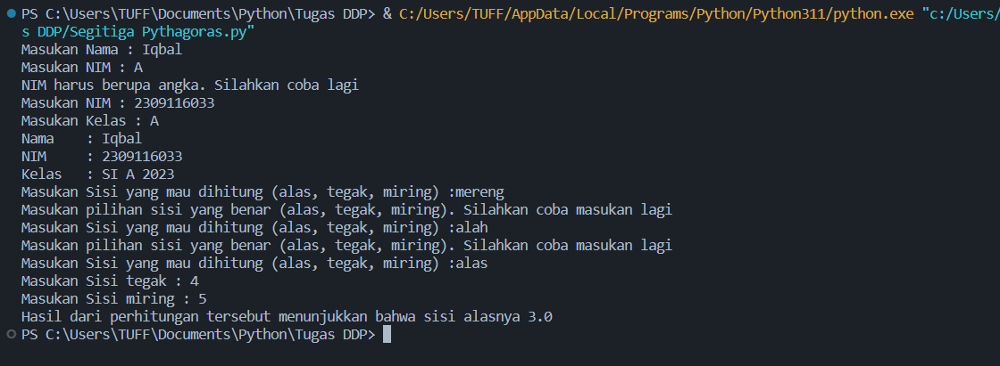

# Post-test-praktikum-DDP

## Flowchart

## Penjelasan Output beserta Screenshot an nya
  Program python yang saya buat ini memiliki Login sederhana dan memungkinkan user untuk menghitung panjang sisi segitiga siku-siku, dengan menggunakan panjang dua   sisi lainnya. Program ini menggunakan teorema Pythagoras untuk melakukan perhitungan.

  Pada program ini saya juga menggunakan perulangan while pada Input NIM dan Input saat pemilihan sisi yang ingin dihitung

  ###1. Login sederhana
  - Program meminta pengguna untuk memasukkan nama mereka melalui input.
    

  - Selanjutnya, program ini menggunakan loop while untuk meminta NIM pengguna. Loop ini akan terus berjalan sampai pengguna memasukkan NIM yang valid (hanya           angka). Disini saya menggunakan .isdigit() yang berguna untuk memeriksa apakah sebuah string hanya memiliki angka atau tidak, jika pada string itu hanya            mengandung angka maka akan bernilai True dan jika memiliki seenggaknya satu saja karakter yang bukan merupakan angka nilai yang akan dihasilkan adalah False.
    
         
  - Setelah NIM yang valid dimasukkan, program meminta masukan kelas melalui input.
    

  - Program mencetak informasi yang telah dimasukkan, yaitu nama, NIM, dan kelas.
    

  ###2. Perhitungan Rumus segitiga Pythagoras
        
  - Program ini menggunakan loop while (kedua) untuk meminta pengguna memilih sisi yang ingin dihitung dalam segitiga     (alas, tegak, atau miring).
    

  - Tergantung pilihan pengguna, program akan meminta masukan panjang sisi-sisi yang diperlukan 
    (misalnya jika ingin mencari alas akan diminta untuk memasukan panjang sisi tegak dan sisi miring).
    
        
  - Program menghitung sisi yang diminta sesuai dengan rumus Pythagoras yang telah saya berikan.

  - Hasil perhitungan tersebut dicetak ke layar bersama dengan pesan yang sesuai.
    
